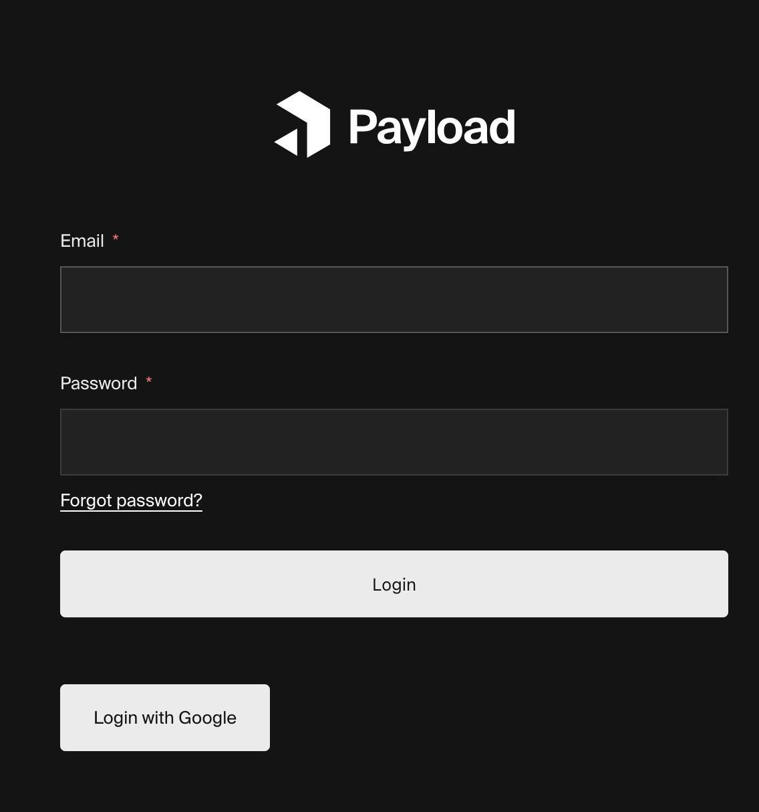

# Payload Admin Panel With Custom View and Google Auth Demo

This is example of payload cms with google auth button for login in admin panel.

## Preparation

You have to create a Project on the google cloud console and within the authentification settings of the projects you need to create an “OAuth-Client-ID”

For “Authorized JS Source” you may put `http://localhost:3000` and for "authrorized callback url" `http://localhost:3000/oauth/google/callback` this has to be the same url that is passed to the OAuth library as callback url, if they don't match you get an error. Changing this URL might take a few minutes to a few hours so don't be impatient.

## Development

To spin up the project locally, follow these steps:

1. First clone the repo
1. Then `cd YOUR_PROJECT_REPO && cp .env.example .env`
1. Next `yarn && yarn dev` (or `docker-compose up`, see [Docker](#docker))
1. Now Open [http://localhost:3000/admin](http://localhost:3000/admin) to access the admin panel
1. Create your first admin user using the form on the page

That's it! Changes made in `./src` will be reflected in your app.

### Docker

Alternatively, you can use [Docker](https://www.docker.com) to spin up this project locally. To do so, follow these steps:

1. Follow [steps 1 and 2 from above](#development), the docker-compose file will automatically use the `.env` file in your project root
1. Next run `docker-compose up`
1. Follow [steps 4 and 5 from above](#development) to login and create your first admin user

That's it! The Docker instance will help you get up and running quickly while also standardizing the development environment across your teams.

## Production

To run Payload in production, you need to build and serve the Admin panel. To do so, follow these steps:

1. First invoke the `payload build` script by running `yarn build` or `npm run build` in your project root. This creates a `./build` directory with a production-ready admin bundle.
1. Then run `yarn serve` or `npm run serve` to run Node in production and serve Payload from the `./build` directory.

### Deployment

The easiest way to deploy your project is to use [Payload Cloud](https://payloadcms.com/new/import), a one-click hosting solution to deploy production-ready instances of your Payload apps directly from your GitHub repo. You can also deploy your app manually, check out the [deployment documentation](https://payloadcms.com/docs/production/deployment) for full details.

## Questions

If you have any issues or questions, reach out to us on [Discord](https://discord.com/invite/payload) or start a [GitHub discussion](https://github.com/payloadcms/payload/discussions).
